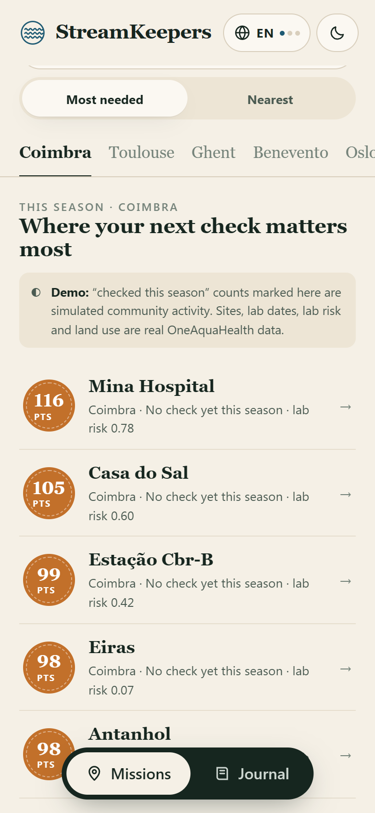
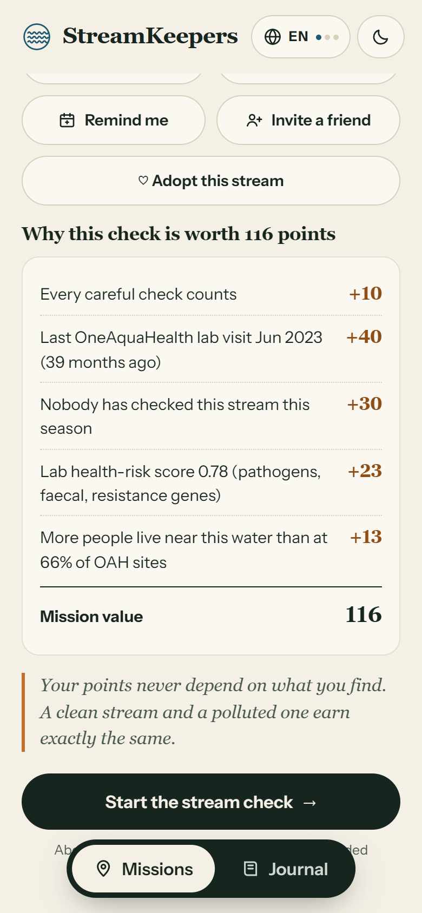
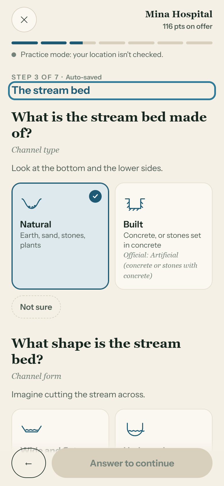
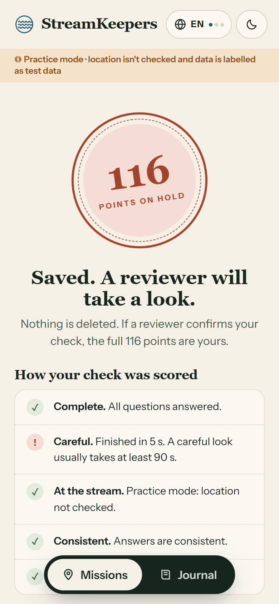
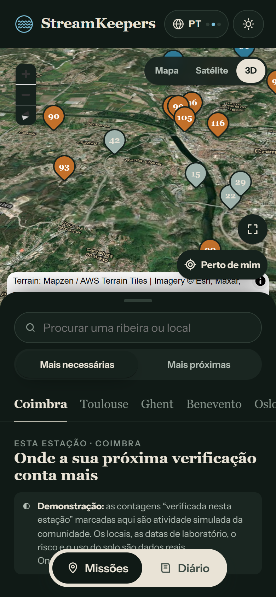
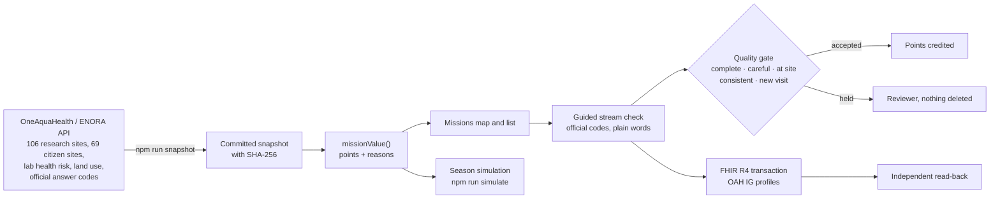

# StreamKeepers

**Citizen-science points that follow what OneAquaHealth needs to know, not how many reports people file.**

OneAquaHealth IEEE Global Hackathon 2026 · **Track 5: Community & Gamification**

**[Open the app](https://streamkeepers.vercel.app/?practice=1)** · [Português](https://streamkeepers.vercel.app/?practice=1&lang=pt) · [Français](https://streamkeepers.vercel.app/?practice=1&lang=fr) · Demo video: [FILL: link] · [Simulation results](eval/sim_results.md)

<p>





</p>

## The problem

OneAquaHealth has 106 research sites on urban streams in five cities, and lab health-risk data for 96 of them: one campaign each, 95 of them in 2023. Between lab visits, citizens are the only eyes on these streams. The OneAquaHealth Citizen Science App collects their checks, but it has no game layer to bring people back.

The obvious fix is points per report, badges and a leaderboard. That rewards volume: people report the same popular spot again and again, while the streams researchers know least about stay unvisited. It can also reward exaggeration, if an alarming report feels more valuable.

## What StreamKeepers does

1. **Prices every stream-check mission from OneAquaHealth's own data gaps.** Time since the last lab campaign, whether anyone has checked the site this season, the lab health-risk score, and how many people live near the water. Each point comes with its reason ("Lab health-risk score 0.78: +23"). A site already checked this season is worth less with every check.
2. **Never pays for the result.** A polluted stream earns exactly the same as a clean one, so there is nothing to gain by exaggerating.
3. **Pays only after a quality check.** A check goes to a reviewer instead of scoring if it was rushed (under 90 s), made far from the site, or contradicts itself: rated "Good" while reporting sewage, or "Poor" while everything reported is natural and clear. Nothing is deleted.
4. **Stores every check in the OneAquaHealth FHIR format** and confirms it by reading it back, not by trusting the server's "OK".

## Evidence

Every number below comes from a script in this repository; nothing is hand-typed.

| Claim | Result | Proof |
|---|---|---|
| Fewer forgotten streams (**simulation**: real sites, simulated volunteers) | With 10 volunteers per city, **23% fewer sites go unchecked** in a season than with classic flat points (31% → 24% unchecked), at the same median trip (2.3 km). High-risk sites checked at least once: 71% → 79%. | [`eval/sim_results.md`](eval/sim_results.md), `npm run simulate`, 200 paired seeded runs, the app's own `missionValue()` |
| What the OneAquaHealth data adds (ablation) | A smaller part of the gain: the same code without lab and population data reaches 75% coverage and 76% high-risk coverage (vs 76% and 79%). Most of the gain comes from lowering the value of crowded sites. | same file |
| What points do **not** do | They don't move effort towards distant high-risk sites: the share of checks made at high-risk sites stays about 24%, even with a 3× larger risk weight. Volunteers check streams near home. | same file, "what-if" table |
| The quality check never penalises a genuine pollution report | A careful, consistent polluted-stream report is accepted like a clean one; rushed, far-away or contradictory ones go to review. | [`src/domain/qualityGate.test.ts`](src/domain/qualityGate.test.ts) |
| Checks are stored as OneAquaHealth FHIR and verified | An accepted check becomes 11 FHIR resources (QuestionnaireResponse, 7 `observation-indicators-oah` Observations, Location, Questionnaire, Practitioner); each is read back with a separate GET and compared. Reused resources are not duplicated. | `npm run fhir:smoke`, [`eval/fhir_smoke_last.json`](eval/fhir_smoke_last.json), [`src/fhir/mapping.test.ts`](src/fhir/mapping.test.ts) |
| Every screen works in English, Portuguese and French | A test fails if any question, answer, reason or message is missing a translation or a placeholder. | [`src/i18n/coverage.test.ts`](src/i18n/coverage.test.ts) |

`npm test` runs 45 tests.

## How it differs from what OneAquaHealth already has

- **The Citizen Science App** collects checks. StreamKeepers uses **the same questions and the same answer codes** (loaded from the public OneAquaHealth API), so its checks can sit next to the app's own. It adds the reason to come back and a way to decide where to go.
- **The Resilience Map and City Dashboards** show lab results. StreamKeepers turns the gaps in those results into missions for volunteers.
- **The FHIR Implementation Guide** defines how indicators are stored. StreamKeepers writes to it and found one gap (see Limits).

## Try it

**On a phone:** open **https://streamkeepers.vercel.app/?practice=1**. Practice mode lets you do a check from anywhere; practice data is labelled as test data.

Things to look for:
- **Coimbra list:** Mina Hospital is worth 116 points, never checked this season. Exploratório is worth 15 because it has been checked 9 times. Those 9 checks are simulated community activity, and the app says so.
- **Mission page:** every point explained. Directions, Street View, a calendar reminder, invite a friend, adopt the stream.
- **A check in under 90 seconds** is held for review with points on hold. A careful one scores.
- **Header:** language toggle (EN → PT → FR) and light/dark theme. **Map:** Plan, Satellite and 3D relief; Near me; enlarged map.

**Locally:**

```bash
npm install
npm run dev            # http://localhost:5173/?practice=1
npm test               # 45 tests
npm run simulate       # rewrites eval/sim_results.md (about a minute)
npm run fhir:smoke     # writes a practice check to a FHIR server and reads it back
npm run snapshot       # refreshes the OneAquaHealth data snapshot
```

The 3D view needs a production build (`npm run build && npm run preview`). See [docs/TESTING.md](docs/TESTING.md) for the user-test protocol.

## How it works



- **Front end:** React + TypeScript (Vite), Leaflet for the map, MapLibre GL for 3D relief (loaded only when chosen). It installs nothing and works without an account.
- **Data:** the public OneAquaHealth / ENORA API, snapshotted in [`src/data/oah/`](src/data/oah/) with fetch time and SHA-256, so the app keeps working if the API is down.
- **Offline:** checks are saved on the phone first and sent when the connection returns; a half-done check can be resumed.

### FHIR mapping (OneAquaHealth IG, `http://hl7.eu/fhir/ig/oah`)

| Resource | Profile / code | When |
|---|---|---|
| QuestionnaireResponse | answers with the official OAH app code systems | every check |
| Observation | `observation-indicators-oah`, status `final`: `morophology`, `hydrology`, `foam`, `riparianVegetation`, `LandUse`, `invasiveOrganisms` | only checks that passed the quality check |
| Location | `location-oah`, identifier = OAH site code | created once (conditional create) |
| Practitioner | pseudonymous volunteer ID, no name | created once |
| Questionnaire | the StreamKeepers form, versioned | created once |

"Not sure" answers never become indicator data. Practice checks carry the standard `HTEST` security label.

## Limits

- **The simulation is a model.** Sites and their data are real; the volunteers and how much they care about points are assumptions. The results table shows how the numbers change with the main assumption. When volunteers ignore points, all rules give the same result, as they should.
- **Points spread effort; they don't send people far.** Reaching distant high-risk sites needs other levers, such as lab visits or organised outings.
- **Lab staleness doesn't separate sites yet.** Every public lab campaign is from 2023–24, so this part of the score is the same everywhere.
- **Mission weights are policy choices,** visible in every mission's reasons, not validated science.
- **The OneAquaHealth FHIR sandbox was unreachable during the build** (from 23 September 2026). Practice checks were therefore verified on the public HAPI R4 test server; the app says so on screen. Real checks are never sent to a public test server; they wait on the phone.
- **A gap in the IG:** `observation-indicators-oah` fixes `status = final`, so there is no place for unreviewed citizen data. StreamKeepers keeps held checks as QuestionnaireResponses until a reviewer confirms them.
- **Not built:** accounts, a separate social network (the app links to the OneAquaHealth Community groups instead), push notifications (calendar reminders instead), and the reviewer's side of the quality check.
- **User testing:** [FILL: n testers, SUS score, median time per check, from eval/user_test.md].

## Credits and licence

Data: OneAquaHealth project (EU Horizon Europe), public API by ENORA Innovation. FHIR IG: HL7 Europe (`hl7-eu/oah`). Maps: © OpenStreetMap contributors; imagery © Esri, Maxar, Earthstar Geographics; terrain: Mapzen / AWS Terrain Tiles. This is a hackathon prototype, not an official OneAquaHealth product.

Code: MIT licence.
